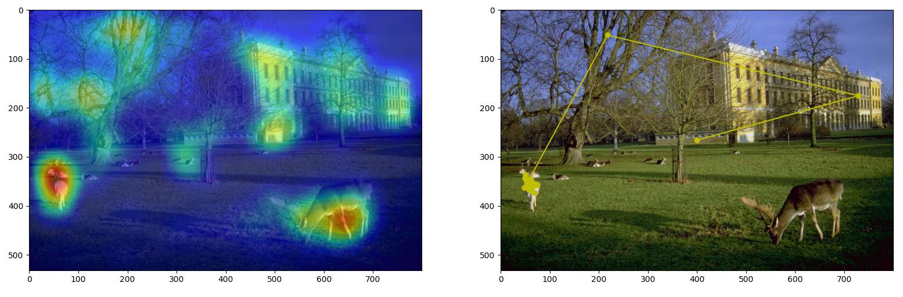

# Constrained Levy Exploration (CLE)



## Description

Generates a visual scanpath by computing gaze shifts as Levy flights on any kind of saliency map (bottom-up or top-down) computed for the  given image. Basically a simple, but slightly enhanced, implementation of the algorithm described in the original paper of Boccignone & Ferraro [1]. The only variant with respect to [1] is the use of an internal simulation step along which a number of candidate gaze shifts is sampled [2].

### Requirements

```text
$ pip install -r requirements.txt
```

### Executing the demo

To simulate from the model run the following command (it is assumed that saliency map is already computed, if you want to compute it on your own, you may want to use something like [this](https://users.soe.ucsc.edu/~milanfar/research/rokaf/.html/SaliencyDetection.html#Matlab) for a low-level one)

```text
$ python3 demo_CLE.py
```

## References

1. Boccignone, G., & Ferraro, M. (2004). Modelling gaze shift as a constrained random walk. *Physica A: Statistical Mechanics and its Applications*, 331(1-2), 207-218.

2. Boccignone, G., & Ferraro, M. (2013). Feed and fly control of visual scanpaths for foveation image processing. *Annals of telecommunications-annales des télécommunications*, 68(3-4), 201-217.  

3. Boccignone, G., Cuculo, V., & D’Amelio, A. (2019, September). Problems with saliency maps. In *International Conference on Image Analysis and Processing* (pp. 35-46). Springer, Cham.  

4. Boccignone, G., Cuculo, V., & D’Amelio, A. (2019, October). How to Look Next? A Data-Driven Approach for Scanpath Prediction. In *International Symposium on Formal Methods* (pp. 131-145). Springer, Cham.
